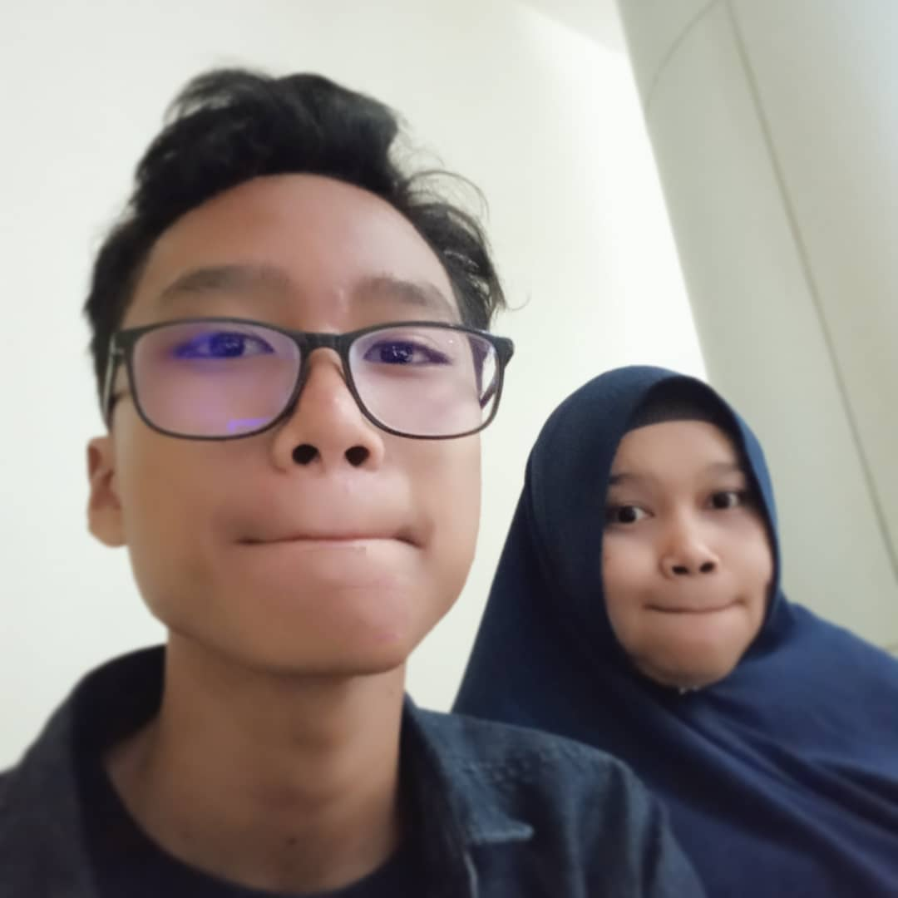

### HELLO, everyone! 

 <!-- Actual text -->

I'm M Alif fadlan 😃

## ⚡ About Me

- Check out my Instagram [fadlan6849]
- This time I'm learning to be a mobile and website developer.
- I’m currently learning Javascript and computer sciences.
- I’m looking to collaborate on projects.
- Please visit my portfolio [website].
- Contact me: fatahhamidzan@gmail.com
  

<!-- Links to my social media accounts

[1]: https://twitter.com/fadlan6849
[2]: https://www.linkedin.com/in/m-alif-fadlan-9a3771229/-->
[website]: https://portofoliov2.netlify.app/
[fadlan6849]: https://www.instagram.com/fadlan6849/
